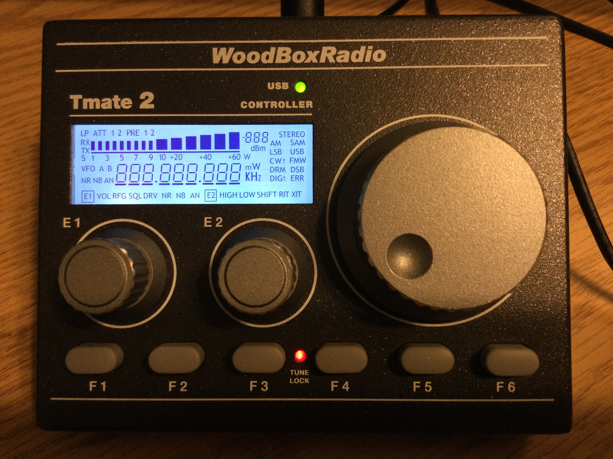
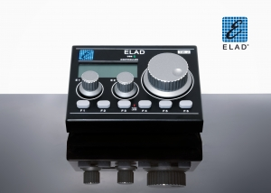

# Tmate 2

This is a C program that interfaces with the Elad (Woodbox Radio) Tmate 2.

For Linux, 50-TMATE2.rules needs to be added to /etc/udev/rules.d to add the Tmate 2 device to the plugdev group so a normal user can access it.

## Hardware overview

The TMate 2 appears as a USB HID device. There are over 170 different LCD segments, each controlled by a bit in uploaded data stream. The names of the data fields are taken from the Tmate2LcdSegment.pdf document. There are additional fields to turn the two (Green and Red) LED's on or off, to set the RGB backlight color, to set the contrast and step size for the main encoder and acceleration.

## hardware input
To get the state of the encoders and buttons, read the device. The first byte is a 1, the next 8 bytes are four 16-bit signed words:
1. Main Encoder Position
2. E1 Encoder Posistion
3. E2 Encoder Posistion
4. Button/Switch bit flags (0 if depressed, 1 if not):
    -   1: F1
    -   2: F2
    -   4: F3
    -   8: F4
    -  16: F5
    -  32: F6
    -  64: Main Encoder Push
    - 128: E1 Encoder Push
    - 256: E2 Encoder Push

# Program operation
Note: Linux may install the USB device with root-only access. To install with the group PLUGDEV, install 50-TMATE2.rules into udev, usually /etc/udev/rules.d. Make sure the user is a member of the PLUGDEV group.

#include "tmate2.c"

call set_xxx_move where xxx is main, e1 or e2 to set a callback function that will be called whenever motion of the encoder is detected. callback function take an int parameter which indicates how far and in which direction the encoder has moved. Note: the main encoder indicates a positive delta for counter-clockwise, e1 and e2 indicate a positive delta for clockwise. This is just the way the hardware works. The callback function returns void.

The software recognizes a tap and a longer press of the three encoders and the f1 .. f6 buttons. The minimium time (in calls to tmate2_tick) is hardcoded as #define PRESS_CT in tmate2.c. 

cal set_xxx_tap where xxx is main, e1, e2, f1 ... f6 to install a callback when a tap of the button is detected.

call set_xxx_press to install a callback when a press of the button is detected. 

The callback function takes no parameters and returns void.

call init_tmate2();  returns true if Tmate2 successfully opened. The USB vendor_id and product_id are hardcoded as #efine VENDOR_ID and #define PRODUCT_IT in tmate2.c.

peridically call tmate2_tick()

when done call tmate2_close()

see main.c for a trivial example.

## Libraries
sudo apt install libudev-dev libhidapi-dev

